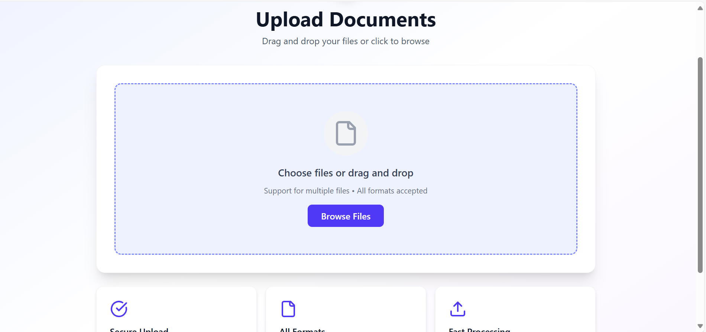
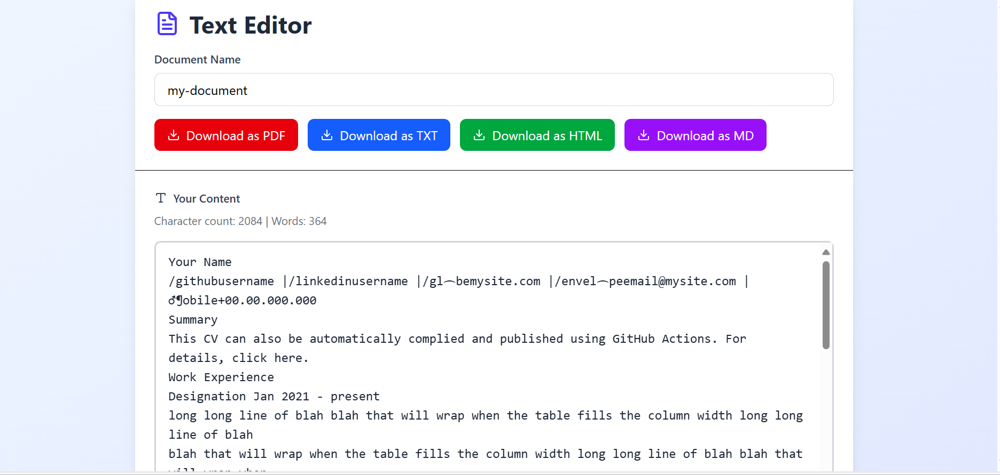

# resume-ai-assistant
An intelligent resume-building assistant that helps users upload, edit, and optimize resumes with AI.
Built with React + TailwindCSS (frontend), Django (backend), FastAPI (data pipeline), and OpenAI API for AI-powered suggestions.

#Features
✅ Resume Upload & Storage – Upload your resume in document formats and store securely.
✅ Document Editor – Edit resumes directly inside the app.
✅ AI Resume Assistant – Get AI-powered suggestions for improving resumes.
✅ Job Suggestions – Personalized job recommendations based on resume content.
✅ Smart Data Handling – FastAPI is used to handle data transfer between React frontend and Django backend.
✅ Modern UI – Responsive, clean, and fast interface built with TailwindCSS.

🏗️ Tech Stack
Frontend

⚛️ React (with Hooks & Context API)

🎨 TailwindCSS (modern responsive styling)

Backend

🐍 Django (for user management, authentication, and storage)

⚡ FastAPI (for high-performance communication between frontend and backend)

AI Integration

🤖 OpenAI API (resume improvements, AI assistant, job suggestions)

⚙️ Setup & Installation
1️⃣ Clone the Repository
    git clone https://github.com/yourusername/ai-resume-assistant.git
    cd ai-resume-assistant
2️⃣ Setup Backend (Django)
    cd backend
    python -m venv venv
    source venv/bin/activate   # (Linux/Mac)
    venv\Scripts\activate      # (Windows)
    pip install -r requirements.txt
    python manage.py migrate
    python manage.py runserver

3️⃣ Setup API Service (FastAPI)
    cd api
    uvicorn main:app --reload

4️⃣ Setup Frontend (React + Tailwind)
    cd frontend
    npm install
    npm run dev

🔑 Environment Variables

    Create a .env file inside backend/ and api/ with the following:
    OPENAI_API_KEY=your_openai_api_key

💡 Usage

    Start Django backend → python manage.py runserver

    Start React frontend → npm run dev

    Open browser at http://localhost:5173

🖼️ Screenshots

### File Upload 
  

### Resume Editor  
  

📌 Future Improvements

    🔍 AI-powered job matching from LinkedIn/Indeed APIs

    📝 Cover letter generator

    📊 Resume scoring system

    ☁️ Cloud storage integration (AWS/GCP/Azure)